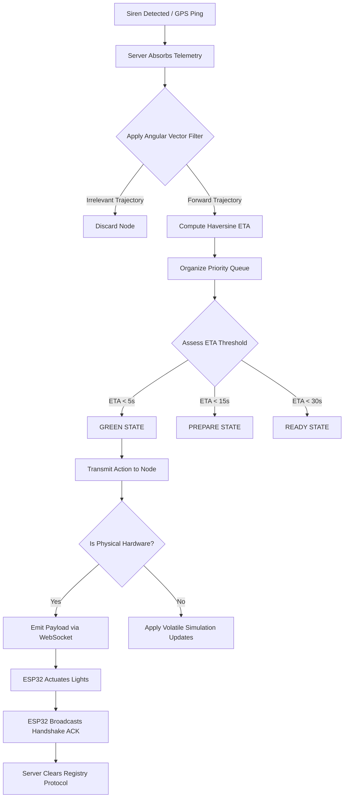

# Technical Project Report 
**Patent Disclosure Document**

## Project Title
**Hybrid Predictive Smart Ambulance Traffic Orchestration System with FFT-Based Acoustic Signatures and Zero-Latency Hardware Actuation**

---

## 1. Executive Summary
This invention proposes a novel hardware-software hybrid architecture for emergency vehicle traffic management. Classical "Green Corridor" systems rely entirely on static geo-fencing, physical sirens overriding single signals, or manual human intervention. This system introduces an **Intelligent Predictive Multi-Node Orchestration Engine**. It combines real-time Fast Fourier Transform (FFT) siren hardware detection with a deterministically scaled software prediction algorithm capable of dynamically managing cascading "Green Waves" across both physical and simulated metropolitan nodes safely, without gridlocking civilian traffic.

---

## 2. Problem Statement
Current conventional traffic clearance systems face severe limitations:
* **Reactive Delays:** Traffic signals only turn green *when* an ambulance is immediately detected, forcing the ambulance to heavily brake while the intersection clears.
* **Hardware Inflexibility:** They require deploying massive infrastructural upgrades to every single intersection simultaneously.
* **False Positives:** Basic acoustic decibel sensors mistakenly actuate signals due to unrelated urban noise (car horns, construction).
* **Network Vulnerability:** Systems fail catastrophically and lock into red or green when local networking crashes, causing municipal accidents.

This project solves these fundamental weaknesses directly.

---

## 3. System Architecture Overview

The system strictly decouples logical intent from electro-mechanical hardware execution, scaling across two primary infrastructural domains:

### 3.1 Hardware Actuators & Telemetry Ingestion (ESP32)
1. **The Siren Validation Unit:** A localized ESP32 microprocessor paired with a KY-037 Sound Module utilizing a native **Fast Fourier Transform (FFT)** library. Instead of listening merely for volume, the microprocessor mathematically slices incoming soundwaves, targeting the specific peak frequencies bounded between `700Hz - 960Hz` (Standard Yelp/Wail Sirens), completely eliminating structural false positives. It uses a multi-frame buffer requiring 3 consecutive temporal hits before validation.
2. **The Intersection Actuation Unit:** An ESP32 tasked with managing 4-way traffic signals. Rather than polling for HTTP data, it holds a permanent, bi-directional `WebSocket (Engine.io v4)` persistent pipe to the centralized server, guaranteeing physical light actuation in `< 25 milliseconds`. 

### 3.2 Centralized Predictive Orchestration (Node.js Server)
The centralized logic hub runs on a JavaScript processing core, enabling both real-time communication protocols (Socket.io) and RESTful validation.
* **The Predictive Routing Engine:** Collects geospatial data to evaluate trajectory sequences dynamically.
* **The Traffic Decision Controller:** Processes spatial geometry using threshold-based logic to issue state changes exclusively to necessary forward nodes.

---

## 4. Key Patented Algorithms & Technical Novelties

### 4.1 Recomputation Interval & Predictive Distance Computation 
The system algorithmically models the vehicle's approach seamlessly. It systematically triggers every $I_{rec}$ (e.g. 1000ms), natively performing computationally cheap **Haversine Distance Mapping** and Angular Heading vector comparison to drop non-forward nodes from memory instantly, processing ETA ($D_i / V_t$).

### 4.2 Dynamic Signal Staging Algorithm
The logic does *not* issue binary Red/Green constraints. It utilizes a deterministic tier hierarchy ensuring safe displacement of civilian cars:
* **READY Phase ($ETA < 30s$):** Omnidirectional Yellow Flashes.
* **PREPARE Phase ($ETA < 15s$):** Perpendicular Traffic Stop Phase (Reducting Intersection-Box trapped cars).
* **GREEN Phase ($ETA < 5s$):** Definitive Right-of-way granted.

### 4.3 Autonomous Fail-Safe Disconnect Mode
Built into the Intersection Hardware framework. If the websocket pipe disconnects, the physical unit triggers a $10$-second countdown validation. If severed, the hardware autonomously strips away algorithmic authority and forces the entire junction into a standard municipal "Flashing-Yellow Warning State" protecting civilian flow even under total systemic communication failure.

### 4.4 Dominance Dispute Matrix
The system applies objective $P(V)$ mathematical scalar indexing to resolve overlapping ambulance routes. Combining Incident Severity and Vector ETAs, overlapping corridor requests systematically yield to the maximum index constraint natively, preventing cross-collisions. 

---

## 5. Algorithmic Processing Workflow

---

## 6. Implementation Scalability & Conclusion
The hallmark of the invention resides within its **Hybrid Hardware-Software Decoupling**. By treating simulated nodes and physical IoT devices under the same logic queue but physically splitting their execution environments (`type: 'simulated'` vs `type: 'physical'`), an entire city can map a cascading 15-node Green Corridor, smoothly clearing traffic 2 kilometers ahead while physically owning only a fraction of hardware nodes.

This invention reduces emergency response times, minimizes intersection collisions, and establishes a radically cheaper implementation path for municipal administrations—establishing it as a robust candidate for patent protection.
