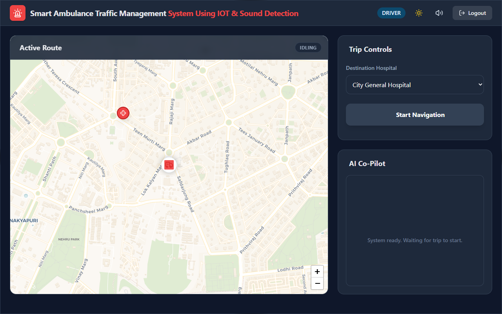

# 🚑 Smart Ambulance Traffic Management System

> A real-time, IoT-integrated web system that autonomously creates a **Green Corridor** for ambulances by overriding traffic signals, dynamically rerouting around congestion, and providing voice-assisted AI Co-Pilot navigation.

---

## 📸 Preview



---

## ✨ Features

- 🗺️ **Live Map Tracking** — Real-time ambulance position on an interactive Leaflet.js map
- 🚦 **Green Corridor** — Automatic traffic signal override via ESP32 + KY-037 siren detection
- 🔀 **Dynamic Re-routing** — Congestion detected → alternate route calculated and drawn instantly
- 🎙️ **AI Co-Pilot** — Voice-guided navigation using Web Speech API with priority interrupt queue
- 🔊 **Virtual Siren** — Programmatic Hi-Lo siren generated via Web Audio API (no external files)
- 👤 **Role-Based Dashboards** — Separate Admin and Driver views with JWT authentication
- 📋 **Live Event Logs** — Real-time system logs persisted to JSON, broadcast via WebSocket
- ⚡ **Sub-250ms Latency** — From siren detection to LED actuation on local Wi-Fi

---

## 🏗️ System Architecture

```
┌─────────────────────────────────────────────┐
│         TIER 1: CLIENT (Browser)            │
│  HTML5 | CSS3 | Leaflet.js | Web Speech API  │
└──────────────────┬──────────────────────────┘
                   │  HTTP REST + WebSocket
┌──────────────────▼──────────────────────────┐
│         TIER 2: SERVER (Node.js)            │
│  Express.js | Socket.io | TrafficController  │
└──────┬───────────────────────────┬──────────┘
       │ HTTP POST                 │ WebSocket
┌──────▼──────┐           ┌────────▼──────────┐
│ ESP32 Sensor│           │  ESP32 Actuator   │
│ KY-037 Mic  │           │  LED Traffic Lights│
└─────────────┘           └───────────────────┘
```

---

## 🛠️ Tech Stack

| Layer | Technology |
|---|---|
| **Backend** | Node.js, Express.js v5, Socket.io v4 |
| **Frontend** | HTML5, CSS3, Vanilla JavaScript |
| **Mapping** | Leaflet.js + OpenStreetMap + OSRM |
| **Auth** | JSON Web Tokens (JWT), bcryptjs |
| **Voice** | Web Speech API, Web Audio API |
| **Hardware** | ESP32, KY-037 Sound Sensor, LEDs |
| **Dev Tools** | nodemon, Puppeteer, dotenv |

---

## 📁 Project Structure

```
smart-ambulance/
├── server.js               # Entry point — Express + Socket.io server
├── package.json
├── .env                    # Environment variables (not committed)
├── services/
│   ├── TrafficController.js  # Core traffic logic, emergency override, adaptive timing
│   └── LogService.js         # Event logger with JSON persistence
├── routes/
│   ├── auth.js               # Login/Logout JWT endpoints
│   └── iot.js                # ESP32 trigger + density + hazard endpoints
├── public/
│   ├── index.html            # SPA entry point with role-based templates
│   └── js/
│       ├── app.js            # Auth, dashboard init, role routing
│       ├── socket.js         # WebSocket event handlers
│       ├── map.js            # Leaflet map, route drawing, ambulance animation
│       └── voice.js          # TTS Co-Pilot + Web Audio API siren
├── data/
│   └── logs.json             # Persistent event logs (auto-created)
└── test.js / test-nearest.js # Puppeteer UI test scripts
```

---

## 🚀 Getting Started

### Prerequisites
- [Node.js](https://nodejs.org/) v18 or higher
- npm v9+
- Google Chrome (required for Web Speech API + Web Audio API)

### Installation

```bash
# Clone the repository
git clone https://github.com/your-username/smart-ambulance.git
cd smart-ambulance

# Install dependencies
npm install
```

### Environment Setup

Create a `.env` file in the root directory:

```env
PORT=3000
JWT_SECRET=your_secret_key_here
```

### Running the App

```bash
# Development (auto-restart on file save)
npx nodemon server.js

# OR production
node server.js
```

Open your browser and go to: **http://localhost:3000**

---

## 👤 Default Credentials

| Role | Username | Password |
|---|---|---|
| Admin | `admin` | `admin123` |
| Driver | `driver1` | `password123` |

> ⚠️ Change these in `routes/auth.js` before any real deployment.

---

## 🧪 Running Tests

```bash
# UI test — Login & dashboard render
node test.js

# Map test — Hospital select & route load
node test-nearest.js
```

Screenshots are saved to the project root.

---

## 🔌 IoT API Endpoints

| Method | Endpoint | Description |
|---|---|---|
| `POST` | `/api/iot/ambulance-detected` | Activate/deactivate emergency mode |
| `POST` | `/api/iot/traffic-density` | Update traffic density (low/medium/high) |
| `GET` | `/api/iot/signal-status` | Get current signal state (ESP32 polling) |
| `POST` | `/api/iot/hazard-alert` | Report a road hazard |

**Example — Trigger Emergency (from ESP32 or curl):**
```bash
curl -X POST http://localhost:3000/api/iot/ambulance-detected \
  -H "Content-Type: application/json" \
  -d '{"direction": "south", "active": true}'
```

---

## 📡 WebSocket Events

| Event | Direction | Description |
|---|---|---|
| `traffic-state` | Server → Client | Full signal state broadcast |
| `emergency-alert` | Server → Client | Emergency banner + siren trigger |
| `new-log` | Server → Client | Real-time log entry |
| `driver-location` | Client → Server | GPS relay for map update |

---

## 🔧 Hardware Setup (ESP32)

| Component | ESP32 Pin |
|---|---|
| KY-037 Analog Out | GPIO34 |
| Red LED | GPIO5 |
| Yellow LED | GPIO18 |
| Green LED | GPIO19 |

> Connect all LEDs with **220Ω resistors**. The ESP32 connects to the same Wi-Fi network as the server and sends HTTP POST to `/api/iot/ambulance-detected` on siren detection.

---

## 📊 Performance

| Metric | Result |
|---|---|
| End-to-end emergency latency | ~210ms |
| Route recalculation (visual) | < 50ms |
| WebSocket reconnection | ~1.8s |
| Test pass rate (10 runs) | 100% |

---

## 🛣️ Roadmap

- [ ] Live GPS module (NEO-6M via MQTT)
- [ ] YOLO-based visual ambulance detection
- [ ] Cloud deployment (AWS + Redis Pub/Sub)
- [ ] Multi-hospital capacity-aware dispatch
- [ ] React Native civilian alert companion app

---

## 📄 License

This project is for academic/educational purposes.

---

## 👥 Team

- **Priyanshi** (Team Lead) — B.E CSE
- **Pratham Chadda** — Teammate
- **Raghav Garg** — Teammate
- **Priya** — Teammate

*Smart Ambulance Traffic Management System — College Project — March 2026*
