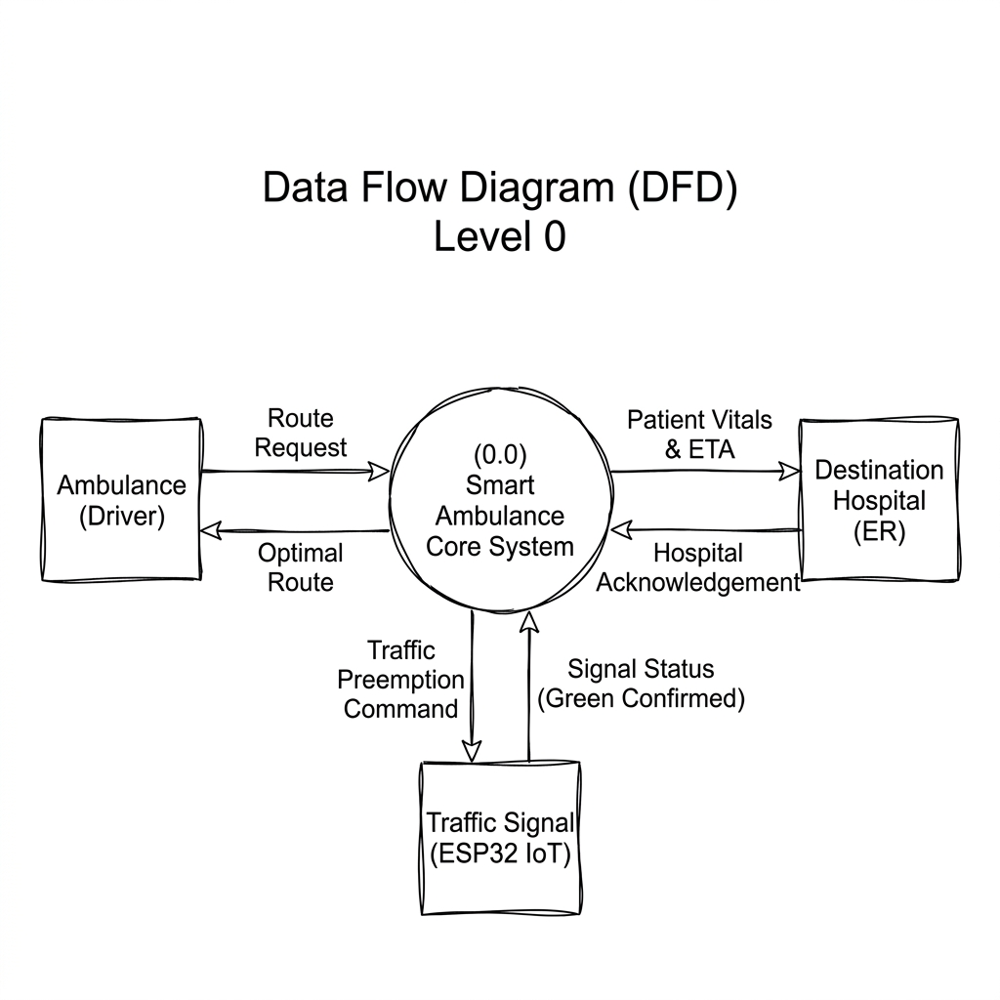
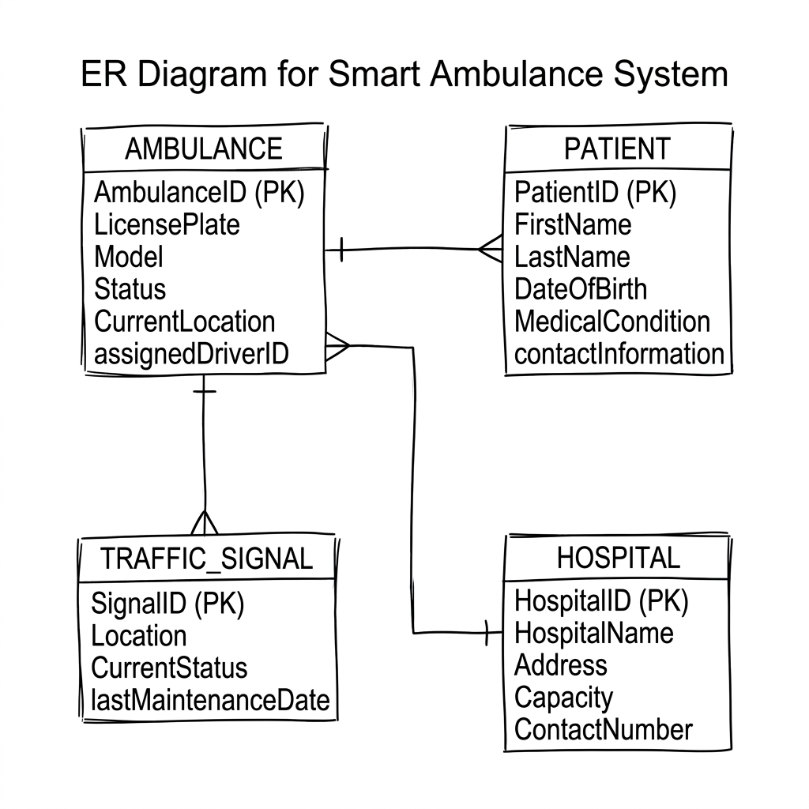
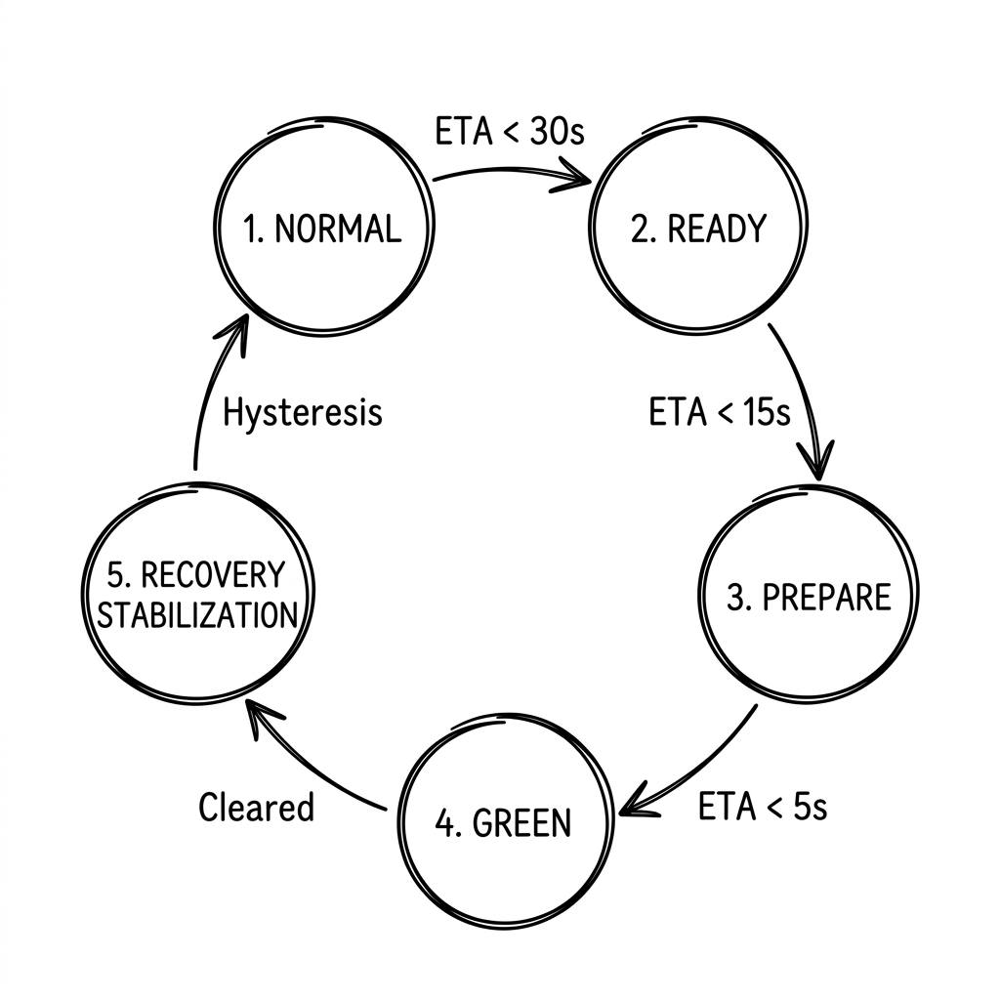

# Smart Ambulance System: Simplified Diagrams (Guaranteed White Background)
> **Minimalist, Clean Black & White DFD & ER Diagrams for Presentations (PPT) with Solid White Backgrounds**

Since dynamic code blocks can sometimes adapt to your editor's Dark Mode, we have generated **two separate PNG images** with an **absolute, solid white background**. 

You can find these images directly in your project folder as `simple_dfd_white.png` and `simple_er_white.png`. Simply copy-paste them onto your white PPT slides!

---

## 1. DFD Level 0 (Context Diagram) - Solid White PNG Image
*This diagram shows the main processes: who sends what data, and who receives it.*

---

---

## 2. ER Diagram (Core Database Entities) - Solid White PNG Image
*This diagram shows the 4 core database tables, their keys, and how they connect.*

---

## 3. Signal Phase Machine (State-Transition Diagram - FIG. 5)
*This diagram shows the transitions between the NORMAL, READY, PREPARE, and GREEN states with hysteresis and temporal buffers.*

